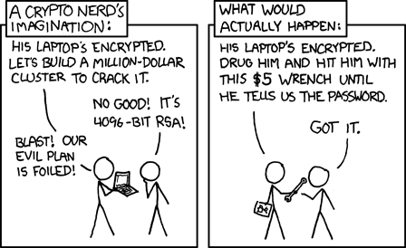

If you're new to Bitcoin and cryptocurrency, you may have heard the common phrase [not your keys not your coins](https://www.youtube.com/watch?v=dnC5mFaIW3Q). While self-custody isn't for everyone, its the only way to truly have exclusive control over your funds. If that's what you're into, read on.

## Dangers of storing your own Bitcoin

In order to spend your Bitcoin, you need to have access to your [wallet](https://bitcoin.org/en/choose-your-wallet) or to the [seed phrase](https://en.bitcoin.it/wiki/Seed_phrase) that was created alongside the wallet. Likewise, an attacker only needs access to one of those two things in order to steal all your coins.

A seed phrase is essentially the _master key_ to a crypto wallet and usually comes in the form of 12 or 24 words. If you lose your wallet, for example maybe the phone your wallet was on becomes lost, then you can use the seed to regenerate every private key in the wallet and regain access to your Bitcoin.

Example of a BIP-39 seed phrase:

```
witch collapse practice feed shame open despair creek road again ice least
```

## Methods for securing your Bitcoin seed phrase

Like choosing a wallet, choosing a method to store your seed phrase depends slightly on your technical abilities and personal needs. Let's go over some options and weigh the pros and cons.

### Storing the seed phrase on paper

This is the simplest method, and for many people it's a good start.

- Can't be hacked digitally
- Can be physically stolen
- Free
- Easily destroyed (eaten by a dog, burned, soaked, etc)
- Easily lost, but can be mitigated by using [Shamir's Secret Sharing](https://qvault.io/cryptography/shamirs-secret-sharing/), which requires more technical knowledge

### Storing the seed phrase on metal

Here you would etch the words into steel or store them using a product like [CryptoSteel](https://cryptosteel.com/?gclid=EAIaIQobChMIhfOt-MSr5AIVEKrsCh3ubwXpEAAYAiAAEgLqy_D_BwE). This is a great option if you have a significant sum of money that you want to have custody over.

- More expensive than paper
- More difficult to get created
- Can be physically stolen
- Protects against destruction
- Easily lost, but can be mitigated by using [Shamir's Secret Sharing](https://qvault.io/cryptography/shamirs-secret-sharing/), which requires more technical knowledge
- Can't be hacked
- Easily lost, but can be mitigated by using [Shamir's Secret Sharing](https://qvault.io/cryptography/shamirs-secret-sharing/), which requires more technical knowledge

### Storing the seed phrase in your brain

Simply remembering the phrase is referred to as a "[brainwallet](https://en.bitcoin.it/wiki/Brainwallet)". If the seed is not recorded anywhere, the Bitcoins practically exist only in your mind. The idea is to use memory techniques to allow the words to be memorized and recalled easily.

- Can be lost by forgetfulness or even amnesia or concussions
- Can only be overtly destroyed via injury or death
- There is no way for loved ones to recover the coins if you die
- Impossible to be hacked digitally or stolen physically
- Like all other methods, still susceptible to the $5 wrench attack if the attacker knows you own the coins



[xkcd](https://xkcd.com/538/)

### Storing the seed phrase digitally online

This is almost certainly a bad idea. Only do this if you really know what you're doing, or if you have so little money stored that you aren't worried about losing it all.

- Can easily be hacked - If the machine has access to the internet there are myriad ways that a hacker could steal your coins.
- Hard to lose - You can easily backup multiple copies of the phrase
- Difficult to destroy - You can back the files up using the cloud
- Unlikely a physical break-in to your home will result in loss

### Storing the seed phrase digitally offline

Storing the phrase digitally is usually a bad idea, but if you're going to do it then at least doing it on a machine that doesn't have internet access is preferable.

- Can't easily be hacked unless someone gains access to the device
- Easily lost - Since the seed probably isn't on multiple offline devices if you lose the one it's on you're out of luck.
- Easily destroyed in a house fire or even simple hardware malfunction
- Unlikely a physical break-in to your home will result in loss

Every person and organization will have different preferences for how to store seed phrases. Factors that should influence this decision include the amount of crypto being stored, the technical abilities of the owners, and also tolerance for inconvenience.
