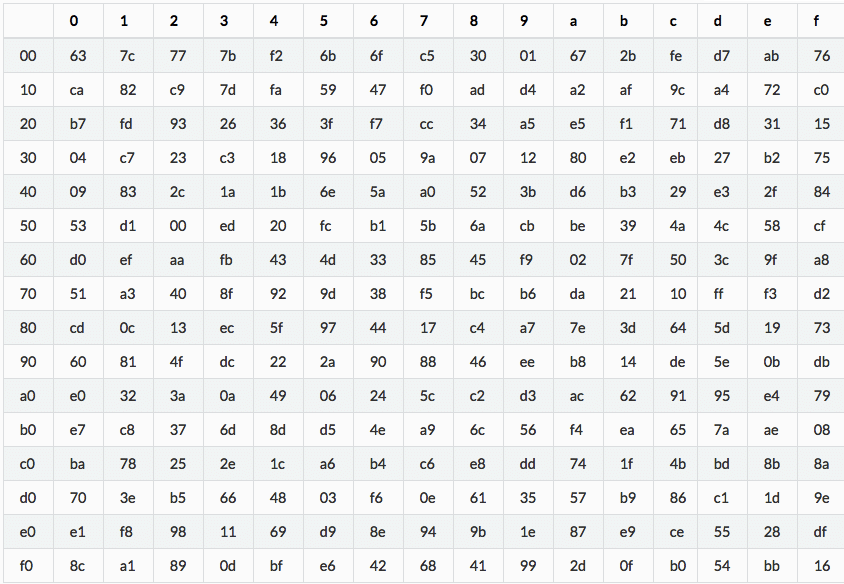

AES, or “Advanced Encryption Standard”, is an encryption specification that uses the Rijndael cipher as its symmetric key ciphering algorithm. AES encrypts a message with a private key, and no one but the key holder can decrypt the message. A great example of a good use-case for AES-256 is encrypting all the data on the hard drive of a computer when it's not in use.

# Symmetric Encryption vs Asymmetric Encryption

**Symmetric encryption uses the same key** for encryption and decryption and **asymmetric encryption uses different keys.**

Asymmetric encryption is preferred when you want someone to be able to send you encrypted data, but **you don’t want to share your private key**.

**Symmetric** encryption is preferred when you are encrypting **only for yourself**.

# AES-256 Secret Key

The secret key used in AES-256 must be 256 bits long. In order to use a password or passphrase as the key, a [hashing algorithm](https://blog.goodaudience.com/very-basic-intro-to-hash-functions-sha-256-md-5-etc-ed721622ff8) needs to be used to extend the length.

The shorter the password or passphrase, the easier it is for an attacker to decrypt the data by guessing passwords, hashing them, and attempting to decrypt the message. In order to mitigate this threat, some applications enforce safeguards, such as using a [KDF](https://qvault.io/2019/12/30/very-basic-intro-to-key-derivation-functions-argon2-scrypt-etc/).

# Encryption Process Overview

Let's walk through the steps of the AES ciphering process, also known as the [Rijndael](https://csrc.nist.gov/csrc/media/projects/cryptographic-standards-and-guidelines/documents/aes-development/rijndael-ammended.pdf) cipher.

1\. Choose a password, then derive a short key from that password (using a function like [Scrypt](https://qvault.io/2020/07/25/very-basic-intro-to-the-scrypt-hash/) or [SHA-256](https://qvault.io/2020/07/08/how-sha-2-works-step-by-step-sha-256/)). This short key will then be expanded using a [key schedule](https://en.wikipedia.org/wiki/Rijndael_key_schedule) to get separate “round keys” for each round of AES-256.

password: password12345678 →
short key: aafeeba6959ebeeb96519d5dcf0bcc069f81e4bb56c246d04872db92666e6d4b →
first round key: a567fb105ffd90cb

Deriving the round keys from the short key is out of the scope of this article. The important thing for us to understand is that a password is converted into round keys which are used in the AES ciphering process.

2\. Choose a secret message:

Here is a secret

3\. Encode the first round key and message in hexadecimal bytes and format them in 4x4 tables (top to bottom, left to right):

First Round Key:

61 66 35 39
35 62 66 30
36 31 66 63
37 30 64 62

Message:

48 20 61 63
65 69 20 72
72 73 73 65
65 20 65 74

4\. Add the round key to the message (XOR). The corresponding cells in the message and key tables are added together. The output matrix will be used in the next step.

> 61 ⊕ 48 = 29
> 
> 35 ⊕ 65 = 50
> 
> …etc

29 46 54 5a
50 0b 46 42
44 42 15 06
52 10 01 16

5\. In the resulting table, use the [substitution box to change each 2-character byte to its corresponding byte](https://www.researchgate.net/figure/Rijndael-S-box-S-RD_fig7_325428613):

[Research Gate](https://www.researchgate.net/figure/Rijndael-S-box-S-RD_fig7_325428613)

a5 5a 20 be
53 2b 5a 2c
1b 2c 59 6f
00 7c 7c 47

6\. Shift rows. The first row doesn’t shift, the second-row shifts left once, the third row twice, and the last row 3 times.

a5 5a 20 be
53 2b 5a 2c → 2b 5a 2c 53
1b 2c 59 6f → 2c 59 6f 1b → 59 6f 1b 2c
00 7c 7c 47 → 7c 7c 47 00 → 7c 47 00 7c → 47 00 7c 7c

a5 5a 20 be
2b 5a 2c 53
59 6f 1b 2c
47 00 7c 7c

7\. Mix Columns. Each column is modulo multiplied by the [Rijndael’s Galois Field](https://www.samiam.org/galois.html). The math involved is outside the scope of this article, so I won’t be including the example output matrix.

[Common lounge](https://www.commonlounge.com/discussion/e32fdd267aaa4240a4464723bc74d0a5)

8\. The output of the multiplication is used as the input “message” in the next round of AES. It repeats each step 10 or more times in total, with one extra “add key” step at the end. Each round of “add key” will use a new round key, but each new round key is still derived from the same password and short key.

- Add key
- Substitute bytes
- Shift rows
- Multiply columns

# That's it! /s

Obviously the Rijndael cipher used in AES is fairly complex but I hope I’ve been able to shed light on a high-level view of what goes on inside! Thanks for reading.

https://www.youtube.com/watch?v=gP4PqVGudtg

## Related Reading

- [AES-256 Cipher – Python Cryptography Examples](https://qvault.io/2020/02/06/aes-256-cipher-python-cryptography-examples/)
- [Is AES-256 Quantum Resistant?](https://qvault.io/2019/07/09/is-aes-256-quantum-resistant/)
