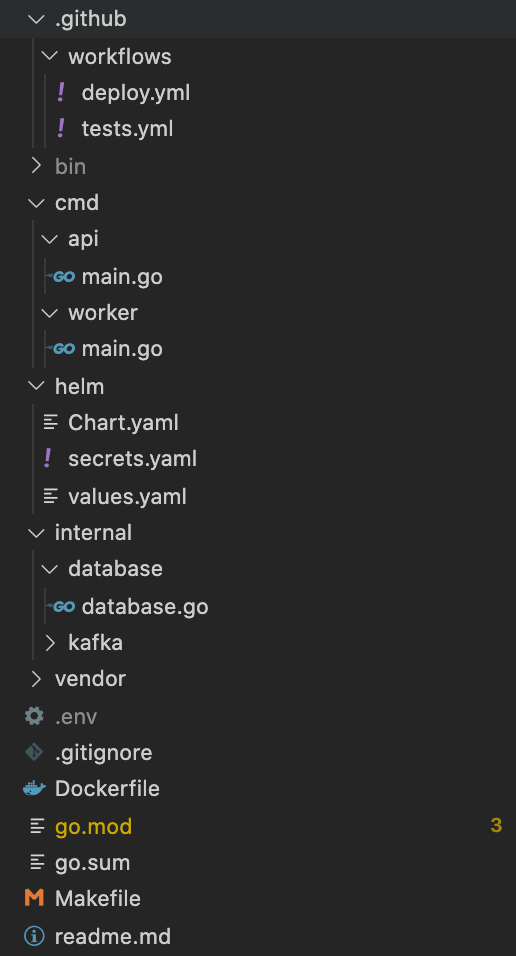

I lead a team that's responsible for anywhere from 15-25 Go microservices at any given time. We're constantly creating new services and libraries, so it's become important to streamline the project creation process. I'm mostly writing this article for myself as a kind of self-documentation, but hopefully, you'll find it useful as you create new Go projects for yourself.

## Example project structure in Go

By the end of this walkthrough, you'll have a project structure that looks something like this.



## Step 1 - Create a Remote Repo and Clone It

I'm a sucker for the old [GOPATH](https://golang.org/doc/gopath_code.html). Using the actual GOPATH is no longer recommended, but I find the single workspace principle neat and orderly. As such, I keep all my projects in:

`~/workspace/src/REMOTE/NAMESPACE/PROJECT`

The fastest way to start a new project is to hop into Github, Gitlab, or wherever your source control is located and [create a new project](https://docs.github.com/en/free-pro-team@latest/github/getting-started-with-github/create-a-repo) with the default `README.md`. Then you can clone it down using `git clone` and the remote Git connection is already set up. For example:

```
cd ~/workspace/src/github.com/wagslane
git clone https://github.com/wagslane/go-rabbitmq
cd go-rabbitmq
```

## Step 2 - Folder Structure

After running `cd` to get into our new project, we create an `internal` directory that will store packages that are meant to be scoped to this project. It will usually contain packages like `database`, `kafka`, `bayesian`, etc. If you didn't know, the [`internal` directory](https://qvault.io/2020/03/29/how-to-separate-library-packages-in-go/) is a Go convention and doesn't allow the Go compiler to accidentally use its packages in an external project.

Next, we create a `cmd` folder where we'll store all the executable `main` packages that will be built at compile time. Each executable will have its own directory in `cmd`.

We also need a `Makefile` that will automatically build all the executables in the `cmd` directory, run tests, check linting and formatting etc. It looks something like this:

```
all: test vet fmt lint build

test:
    go test ./...

vet:
    go vet ./...

fmt:
    go list -f '{{.Dir}}' ./... | grep -v /vendor/ | xargs -L1 gofmt -l
    test -z $$(go list -f '{{.Dir}}' ./... | grep -v /vendor/ | xargs -L1 gofmt -l)

lint:
    go list ./... | grep -v /vendor/ | xargs -L1 golint -set_exit_status

build:
    go build -o bin/api ./cmd/api
    go build -o bin/worker ./cmd/worker
```

Now we have simple commands to run from the repo's root that will do most of the common tasks we care about. (The above assumes a single executable named `api` in the `cmd` directory)

```
make build # build the code
make test # test the code
make vet # check the vetting
make lint # check the linting
make fmt # check the formatting
make # ensure everything passes and builds
```

All of our CI/CD and infrastructure files should reference this `Makefile`. That way if the way we build and test our code changes in the future, we only need to change configurations in one place.

## Step 3 - Go Mod and Vendoring Dependencies

We always vendor dependencies on my team. This means we use the `go mod` tool to download all of our dependencies and commit them to source control alongside our code. There's debate about whether or not this is considered best practice, but we've found comfort in the fact that we have copies of the remote source in case something happens to it.

And it's not like `vendor` is on the same order of magnitude as `node_modules`...


In order to get started, and assuming you actually have a program in your `cmd` folder, just run:

```
go mod init
go mod tidy # unnecessary first time but good habit
go mod vendor
```

This will create three new things in your project root:

- `go.mod` - list of dependencies and versions
- `go.sum` - hashes of dependencies for security reasons
- vendor directory - source code of all dependencies

## Step 4 - .gitignore

I don't like pre-built `.gitignore` files, I like project-specific ones so I start from scratch. This is my typical starting point:

```
.env # ignore local environment variable file
bin/ # ingore built executables
```

## Step 5 - Dockerfile (optional)

If you're containerizing your apps (you probably should), then you'll need a Dockerfile. From here on out everything we do assumes you're using [Kubernetes](https://kubernetes.io/) or something similar to deploy apps.

A minimal `Dockerfile` could look something like this:

```
FROM debian:stretch-slim

WORKDIR /

RUN apt-get update && apt-get install -y ca-certificates

ADD bin /bin/

CMD ["/bin/sh"]
```

We use a lightweight OS, Debian stretch-slim. Remember, we're deploying statically compiled executables! Go is a compiled language, we don't need to include the whole Go toolchain in our deploys.

After that, we just add our executables to the `/bin` directory and launch a shell.

## Step 6 - Github Actions (optional)

So I'm going to get a bit sloppy here. And the reason for that is Github Actions configurations are VERY dependent on the exact tools you use to deploy your apps. We use Kubernetes, [Helm](https://helm.sh/), [Helm Secrets](https://github.com/zendesk/helm-secrets), and [AWS ECR](https://aws.amazon.com/ecr/).

That said, the test file is universally useful. In `github/workflows/tests.yml`:

```
name: Tests

on:
  pull_request:
    branches: [ master ]

jobs:

  test:
    name: Test
    runs-on: ubuntu-latest
    env:
      GOFLAGS: -mod=vendor
      GOPROXY: "off"

    steps:

    - name: Set up Go 1.146
      uses: actions/setup-go@v2
      with:
        go-version: 1.146
      id: go

    - name: Check out code into the Go module directory
      uses: actions/checkout@v1

    - name: Format
      run: make lint

    - name: Vet
      run: make vet

    - name: Test
      run: make test

    - name: Build
      run: make build
```

Then, for your deploys you might use _something_ like this in `github/workflows/deploy.yml`:

```
name: Deploy

on:
  push:
    branches: [ master ]

jobs:

  deploy:
    name: Deploy
    runs-on: ubuntu-latest
    env:
      GOFLAGS: -mod=vendor
      GOPROXY: "off"

    steps:

    - name: Print
      run: echo "Deploying to $DEPLOY_ENV"

    - name: Set up Go 1.146
      uses: actions/setup-go@v2
      with:
        go-version: 1.146
      id: go

    - name: Check out code into the Go module directory
      uses: actions/checkout@v1

    # Only necessary because we are using Helm and need to pull template files
    # from a centrally controlled remote repository
    - name: Check out helm templates
      uses: actions/checkout@v2
      with:
        repository: {NAMESPACE}/{PROJECT}
        path: helm-templates
        ref: v1.3.1
        token: ${{ secrets.REPO_PAT }}

    - name: Move templates to local project directory
      run: mv {PROJECT}/templates helm/templates

    - name: Build Go code
      run: make build

    # We use AWS ECR to store built images, then Helm instructs Kubernetes to pull them down
    - name: Configure AWS Credentials
      uses: aws-actions/configure-aws-credentials@v1
      with:
        aws-access-key-id: ${{ secrets.AWS_ACCESS_KEY_ID }}
        aws-secret-access-key: ${{ secrets.AWS_SECRET_ACCESS_KEY }}
        aws-region: us-east-1

    - name: Login to Amazon ECR
      id: login-ecr
      uses: aws-actions/amazon-ecr-login@v1

    - name: Build, tag, and push image to Amazon ECR
      env:
        ECR_REGISTRY: ${{ steps.login-ecr.outputs.registry }}
        IMAGE_TAG: ${{ github.sha }}
      run: |
        docker build -t $ECR_REGISTRY/${GITHUB_REPOSITORY#*/}:$IMAGE_TAG .
        docker push $ECR_REGISTRY/${GITHUB_REPOSITORY#*/}:$IMAGE_TAG

    - name: Logout of Amazon ECR
      if: always()
      run: docker logout ${{ steps.login-ecr.outputs.registry }}

    - name: Install aws-iam-authenticator
      uses: prepor/action-aws-iam-authenticator@master

    - name: Deploy Helm
      run: |
        curl -LO https://git.io/get_helm.sh
        chmod 700 get_helm.sh
        ./get_helm.sh
        mkdir ~/.helm
        mkdir ~/.helm/plugins
        helm plugin install https://github.com/futuresimple/helm-secrets
        helm secrets upgrade --install ${GITHUB_REPOSITORY#*/} ./helm --namespace ${GITHUB_REPOSITORY#*/} -f helm/values.yaml -f helm/secrets.yaml --debug --set deployment.image.tag=$GITHUB_SHA
        kubectl get deploy -n ${GITHUB_REPOSITORY#*/} --no-headers -o custom-columns=":metadata.name" | xargs -n 1 kubectl rollout status -n ${GITHUB_REPOSITORY#*/} deploy
```

I've totally left out all the Helm and ECR details in this tutorial, mostly because you either:

- Are already familiar with them so you don't care
- Are using something else so you don't care
- Can easily find resources dedicated to those larger topics. Here is a [quickstart](https://helm.sh/docs/intro/quickstart/) for you if you need it.
