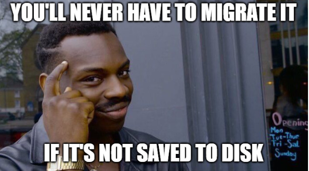

## In this world, nothing can be said to be certain, except death, taxes, and migrations.

Earlier in my career, I would come to a new project and inevitably a hectic migration would be underway. It's not always a "stop the world" change, it can be as simple as switching from NPM to Yarn, but something is always changing. I used to naively believe my managers when they said cute things like "just this once" or "we'll finally have our dependencies up to date."

Let's be clear about something. Migrations are here to stay, and while we can't be rid of them completely, we can learn how to more painlessly execute them. I've put together a small list of guidelines that have helped me cope with migrations, and maybe they'll help you too.

## #1 Get the names right the first time

Naming variables is hard, but naming database keys and API behaviors is much harder. When you name something that other code and systems rely on, you either won't be able to change it in the future, or that migration is going to be excruciating. I have a few rules of thumb [on variable naming](https://qvault.io/clean-code/naming-variables/), so I won't rehash all the details here. That said, here's a tl;dr.

1. Following existing naming conventions of the language or framework that you’re using. In Python, use `snake_case`.
2. Single letter variables have a place, and that place is rare.
3. Include units in your variable names. `sleepTimeMilliseconds` vs `sleepTime`.
4. Include types in your variables names if it isn’t obvious. `createdAt` is better than `created` for a timestamp.
5. Make the name as long as necessary but no longer.
6. Include the meaning of complex calculations in your variable names.
7. Use the properly pluralized form of the item.
8. Don’t use abbreviations or acronyms without sufficient context.
9. No magic numbers or magic values, use a variable.

I'll mention one more that I've been thinking about recently. Just because product or marketing decided that your users are going to be called "friendly huggy bears", doesn't mean you should riddle your code with that name. If there is a more "standard" way to name an entity in your system, that might just be a good idea. Marketing teams are always changing their minds about what to call stuff. If they give you a ridiculous display name for something, maybe use a more descriptive and generic name in the code instead.

## #2 Frameworks vs tools

Migrating from a simple tool, like [moment.js](https://momentjs.com/) or [date-fns](https://date-fns.org/), is fairly easy. Migrating a single-page app from React to Vue is nearly impossible. In fact, you might as well just start over.

I'm not saying to _never_ use frameworks, that would be hypocritical of me since I use Vue.js all the time. I'm saying you need to be okay being tied to your framework for the rest of your project's life. There is a significant "lock-in" cost when using a holistic framework, and if you can get the job done easily without one, why use one? I write Go on the backend, and frankly, I've never even been tempted to use a framework. There are some out there, but the standard library is so rich that writing the API from scratch isn't a problem at all.

Use small tools and libraries over frameworks wherever possible. It's the [Unix philosophy.](https://en.wikipedia.org/wiki/Unix_philosophy)

## #3 Database features are a slippery slope

Forget about changing a database schema for a second, the only thing worse than that is actually changing databases entirely. Moving from MySQL to Postgres may not be so bad, but try moving from Mongo to MySQL - it's not always an easy task. I understand that when you need to push your database to its limits, you may need to take advantage of ElasticSearch's percolate queries or Postgres's partial indexes. If you can do without however, using a smaller feature set will make future moves easier.

Think of your database choice as a tool. If you aren't careful, that tool will morph into a more invasive framework.

## #4 Careful about what you save to disk

I won't go into too much detail on this one either, as I wrote [a whole article on keeping your data simple at rest](https://wagslane.dev/posts/keep-your-data-raw-at-rest/). That said, I'll give you another tl;dr. If you can get away from storing calculated data in your database, you'll never have to move it. In other words, the less you save, the easier your life is. Let me provide an example.

Let's say you have a `height` variable for each user in your database. Now, on the front-end of your application, you need to show everyone who is over 6ft tall that they should get a special size of shirt. You _could_ add a new boolean field in your database, `is_tall` that's set to true for people over 6 feet. My point is that your life will be easier if you do that calculation in your application code each time you query someone's height. If you never save it to disk, you'll never have to migrate it.

## #5 Keep your dependencies organized

While you _can_ make a globally accessible database connection and write SQL queries in any old place, **don't do it**. You'll save yourself a lot of headache by writing a package or module that abstracts knowledge of the database "implementation details" away from the business logic. This is classic "clean architecture" stuff by Uncle Bob Martin, but it won't just keep your code clean, it will make future database changes much easier.

