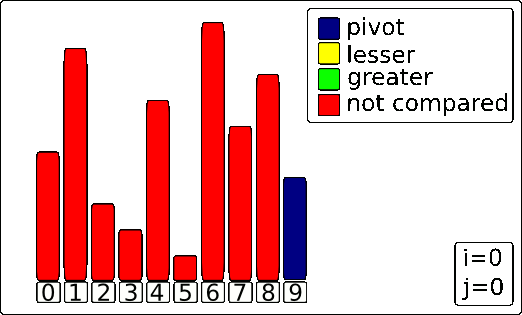

Quicksort is an efficient sorting algorithm commonly used in production sorting implementations. Like [Merge Sort](https://qvault.io/golang/merge-sort-golang/), Quicksort is a [divide-and-conquer algorithm](https://en.wikipedia.org/wiki/Divide-and-conquer_algorithm). As the name implies, Quicksort is one of the fastest sorting algorithms, but you have to pay attention to detail in your implementation because if you're not careful, your speed can drop quickly.

## Divide

- Select a pivot element that will _preferably_ end up close to the center of the sorted pack
- Move everything onto the "greater than" or "less than" side of the pivot
- The pivot is now in its **final** position
- Recursively repeat the operation on both sides of the pivot

## Conquer

- Return a sorted array after all elements have been through the pivot operation

## Quicksort Pseudocode

### Partition() function in Golang

Quicksort actually makes use of two functions, the main `quicksort()` function as well as the `partition()` function. The meat of the algorithm counter-intuitively lives in the `partition()` function. It's responsible for finding the pivot and moving everything to the correct side of the pivot.



In Go, the complete code would look like this.

```
func partition(arr []int, low, high int) ([]int, int) {
	pivot := arr[high]
	i := low
	for j := low; j < high; j++ {
		if arr[j] < pivot {
			arr[i], arr[j] = arr[j], arr[i]
			i++
		}
	}
	arr[i], arr[high] = arr[high], arr[i]
	return arr, i
}
```

### QuickSort() function in Golang

The `quickSort()` function is really just a wrapper around the partition function, and it handles the recursive nature of the algorithm.


```
func quickSort(arr []int, low, high int) []int {
	if low < high {
		var p int
		arr, p = partition(arr, low, high)
		arr = quickSort(arr, low, p-1)
		arr = quickSort(arr, p+1, high)
	}
	return arr
}
```

## Example of using Quicksort in real code

```
fmt.Println(quickSortStart([]int{5, 6, 7, 2, 1, 0))
// prints
// [0, 1, 2, 5, 6, 7]
```

## Why use Quicksort?

On average, quicksort has a Big O of `O(n*log(n))`. In the worst case, and assuming we don't take any steps to protect ourselves, it can break down to `O(n^2)`. The `partition()` function has a single for-loop that ranges from the lowest index to the highest index in the array. By itself, the `partition()` function is `O(n)`. The overall complexity of quicksort is dependent on _how many times_ `partition()` is called.

In the worst case, the input is already sorted. An already sorted array results in the pivot being the largest or smallest element in the partition each time. When this is the case, `partition()` is called a total of `n` times. In the best case, the pivot is the middle element of each sublist which results in `log(n)` calls to `partition()`.

Quick sort has the following properties.

- Very fast in the average case
- In-Place: Saves on memory, doesn't need to do a lot of copying and allocating
- More complex implementation
- Typically unstable: changes the relative order of elements with equal keys

## Ensuring a fast runtime in Quicksort

While the version of quicksort that we implemented is almost always able to perform at speeds of `O(n*log(n))`, it's Big O complexity is still technically `O(n^2)`. We can fix this by altering the algorithm slightly. There are two approaches:

- Shuffle input randomly before sorting. This can trivially be done in `O(n)` time.
- Actively find the median of a sample of data from the partition, this can be done in `O(1)` time.

### Random shuffling optimization

The random approach is easy to code, works practically all of the time, and as such is often used. The idea is to quickly shuffle the list before sorting it. The likelihood of shuffling into a sorted list is astronomically unlikely, and is also _more_ unlikely the larger the input.

### Finding the median optimization

One of the most popular solutions is to use the "median of three" approach. Three elements (for example: the first, middle, and last elements) of each partition are chosen and the median is found between them. That item is then used as the pivot. This approach has the advantage that it can't break down to `O(n^2)` time because we are guaranteed to never use the worst item in the partition as the pivot. That said, it can still be slow_er_ because a true median isn't used.
